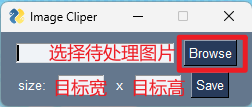
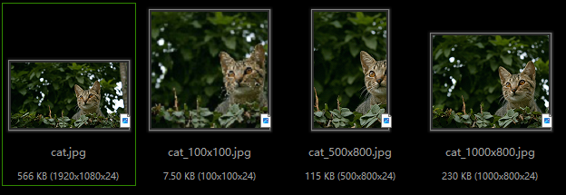

## 图片裁剪
这是一个用来更改图片宽和高的小工具，在处理证件照等图片时比较方便。注意：软件会自动计算，并对原始图片进行适当裁剪，从而避免目标图片出现拉伸现象。
### 使用方法

```
git clone https://www.github.com/dp0qb/ImageCliper.git
cd ./ImageCliper
pip install -r ./requirements.txt
python ./main.py
```
点击"Browse"按钮选择文件，填入想要的宽和高，最后点击保存即可。处理后的图片会保存到源文件同一文件夹下。

